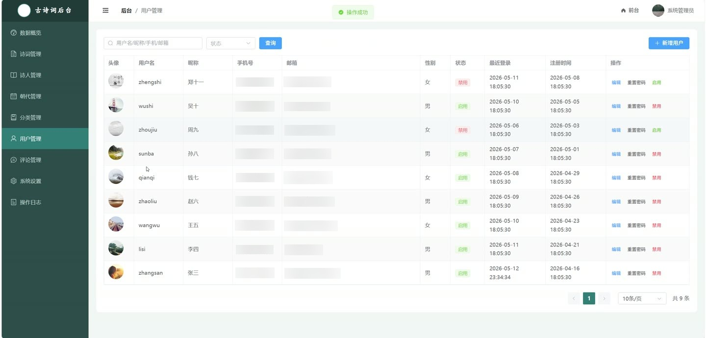
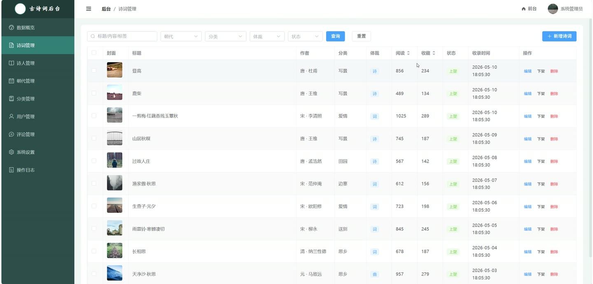

# (附文档)Springboot3+Vue3+MySQL 古诗词查录系统

**技术栈**：Springboot3、Vue3、MySQL

### 系统简介

古诗词查录系统是一套基于 Spring Boot 3 + Vue 3 + MySQL 的前后端分离项目，支持普通用户与管理员双角色。普通用户可浏览、检索、收藏诗词并撰写笔记与评论；管理员可管理诗词、诗人、朝代、分类、用户、评论及系统配置，并查看数据统计仪表盘。
 
### 核心功能
 
### 普通用户端

 
- 查看诗词列表：支持按诗人、朝代、分类、体裁、关键词、上下架状态等条件筛选，分页展示 
- 查看诗词详情：展示标题、原文、注释、译文、赏析、标签、诗人、朝代、分类、封面图、浏览量、收藏数 
- 收藏诗词：点击收藏按钮切换收藏状态，收藏后诗词收藏数实时更新 
- 查看我的收藏：分页展示已收藏诗词列表，支持取消收藏 
- 撰写笔记：在诗词详情页编辑/保存笔记，支持保存或更新，笔记列表分页展示诗词标题与诗人名 
- 发表评论：在诗词详情页提交评论内容，评论需管理员审核通过后展示 
- 查看评论列表：按诗词查看已通过的评论，显示评论者昵称、头像、内容及发表时间 
- 浏览历史：自动记录用户浏览的诗词，支持分页查看与一键清空 
- 诗人列表：按朝代筛选诗人，展示姓名、朝代、头像、作品数量 
- 诗人详情：查看诗人姓名、朝代、生卒年、生平介绍、主要成就、作品列表 
- 排行榜：按浏览量或收藏量展示诗词 Top N 榜单 
- 推荐诗词：在诗词详情页展示同诗人或同朝代的其他诗词推荐 
- 用户注册：填写用户名、密码、昵称、邮箱、手机号、验证码完成注册 
- 用户登录：通过用户名/密码及验证码登录，返回 JWT Token 
- 忘记密码：输入用户名，密码自动重置为 123456 
- 个人中心：查看/修改个人信息（昵称、邮箱、手机号、性别、头像、简介） 
- 修改密码：输入旧密码、新密码进行密码修改 
- 文件上传：支持上传图片等文件，返回可访问的 URL 
- 查看系统配置：公开接口获取站点名称、Logo 等配置信息
 
### 管理员端

 
- 数据概览：查看诗词总数、用户总数、评论总数、待审核评论数等统计卡片数据 
- 朝代诗词分布图：柱状图展示各朝代诗词数量 
- 分类占比图：饼图展示各分类诗词占比 
- 月度新增趋势图：折线图展示每月新增诗词数量趋势 
- 诗词管理：分页查看诗词列表，支持按标题/诗人/朝代/分类/状态筛选 
- 新增诗词：填写标题、诗人、朝代、分类、体裁、原文、注释、译文、赏析、标签、封面图、状态等字段 
- 编辑诗词：修改诗词所有字段 
- 删除诗词：单条删除 
- 切换上下架：一键切换诗词状态（上架/下架） 
- 批量下架：选中多条诗词批量下架 
- 诗人管理：分页查看诗人列表，支持按朝代筛选 
- 新增诗人：填写姓名、朝代、头像、生卒年、生平介绍、主要成就 
- 编辑诗人：修改诗人信息 
- 删除诗人：单条删除（若诗人下有诗词则不允许删除） 
- 朝代管理：分页查看朝代列表，支持关键词搜索 
- 新增朝代：填写朝代名、起始年、结束年、描述、排序值 
- 编辑朝代：修改朝代信息 
- 删除朝代：单条删除（若朝代下有诗词则不允许删除） 
- 分类管理：分页查看分类列表，支持关键词搜索 
- 新增分类：填写分类名、描述、图标、排序值 
- 编辑分类：修改分类信息 
- 删除分类：单条删除（若分类下有诗词则不允许删除） 
- 用户管理：分页查看用户列表，支持按角色/状态筛选 
- 新增用户：管理员后台创建新用户 
- 编辑用户：修改用户昵称、邮箱、手机号、性别、简介 
- 重置密码：将指定用户密码重置为 123456 
- 启用/禁用用户：切换用户状态（正常/禁用） 
- 评论管理：分页查看评论列表，支持按状态（待审核/通过/屏蔽）、诗词筛选 
- 审核评论：通过或屏蔽单条评论 
- 删除评论：单条删除 
- 系统设置：查看/编辑站点名称、Logo 等系统配置键值对，支持批量保存 
- 操作日志：分页查看系统操作日志，支持一键清空
 
### 技术栈

  后端框架 Spring Boot 3.x   ORM MyBatis-Plus 3.x   权限认证 JWT（自定义拦截器）   前端框架 Vue 3（Composition API）   状态管理 Pinia   构建工具 Vite   数据库 MySQL 8.x   连接池 HikariCP 
 
### 交付内容

 
- 后端完整源码 
- 前端完整源码 
- 数据库初始化脚本 
- 万字文档

## 界面展示

---

## 获取完整源码 + 万字文档

本仓库为项目介绍页。**完整前后端源码、数据库初始化脚本、万字项目文档**，请加微信 `kangkangcode`，或访问 [codekk.top](http://codekk.top) 获取。

可作课程设计 / 毕业设计参考，支持远程部署调试。